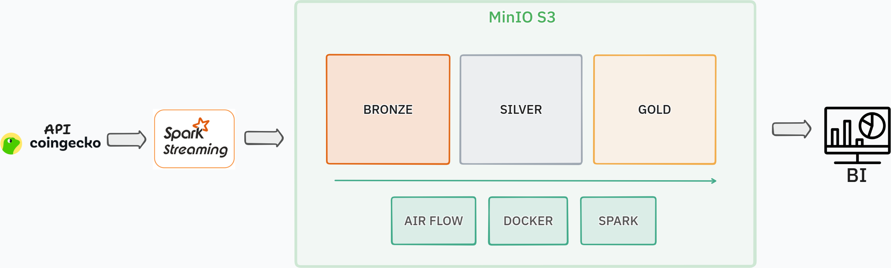

# Crypto Pipeline  Pipeline de Dados Massivos para Criptoativos

Pipeline de ingestão e processamento de dados de mercado de criptoativos via **CoinGecko API**, desenvolvido para a disciplina **Processamento de Dados Massivos (2026/1)**  PUC Minas.

**Autores:** Pedro Henrique R. da Silva · Pedro Henrique A. de Medeiros · Marco Túlio Sousa

---

## Arquitetura




---

## Arquitetura Medallion

| Camada | Formato | Particionamento | Descrição |
|---|---|---|---|
| **Bronze** | JSON | `dt` / `hour` | Dados brutos da CoinGecko, append-only |
| **Silver** | Iceberg | `dt` | Tipado, deduplicado, particionado |
| **Gold** | Iceberg | `dt` | Star Schema  `fct_metricas_hora` + `dim_moedas` |

---

## Stack

| Componente | Tecnologia |
|---|---|
| Ingestão | Spark Structured Streaming + CoinGecko API |
| Object Storage | MinIO (S3-compatible) |
| Table Format | Apache Iceberg |
| Processamento | Apache Spark 3.5.3 |
| Orquestração | Apache Airflow 2.10 |
| Dashboard | Streamlit + Plotly |
| Infra | Docker Compose |
| IaC | Terraform (buckets MinIO) |

---

## Estrutura

```
crypto-pipeline/
├── docker-compose.yml          # MinIO + Spark + Airflow
├── .env                        # Variáveis de ambiente
├── pyproject.toml              # Dependências Python
├── infra/
│   ├── docker/spark/Dockerfile # Spark + Iceberg JARs
│   └── terraform/              # Buckets bronze/silver/gold
├── src/
│   ├── ingestao/
│   │   └── coingecko_producer.py   # Coletor standalone da API
│   ├── streaming/
│   │   └── spark_bronze.py         # Spark Streaming → Bronze
│   ├── processamento/
│   │   ├── silver/
│   │   │   └── mercado_silver.py   # Bronze → Silver (Iceberg)
│   │   ├── gold/
│   │   │   └── metricas_gold.py    # Silver → Gold (Star Schema)
│   │   └── maintenance/
│   │       ├── compaction.py       # OPTIMIZE diário
│   │       └── vacuum.py           # Expire snapshots 7d
│   └── dashboard/
│       └── app.py                  # Streamlit BI
└── airflow/
    └── dags/
        └── crypto_pipeline_dag.py  # DAG: Silver → Gold → Compact → Vacuum
```

---

## Quick Start

```bash
# 1. Subir toda a infra
docker compose up -d

# 2. Provisionar buckets no MinIO
cd infra/terraform
terraform init && terraform apply -auto-approve
cd ../..

# 3. Iniciar Spark Streaming (Bronze)  roda em background coletando a cada 30s
docker exec -d spark-master spark-submit --master local[1] /jobs/streaming/spark_bronze.py

# 4. Processar Silver (Bronze → Iceberg deduplicado)  substituir a data conforme necessário
docker exec spark-master spark-submit --master local[*] /jobs/processamento/silver/mercado_silver.py --execution_date $(date +%Y-%m-%d)

# 5. Processar Gold (Silver → Star Schema)  mesma data usada no Silver
docker exec spark-master spark-submit --master local[*] /jobs/processamento/gold/metricas_gold.py --execution_date $(date +%Y-%m-%d)

# 6. O Airflow roda diariamente: Silver → Gold → Compactação → Vacuum
#    Acesse http://localhost:8080 (admin/admin) para monitorar

# 7. Dashboard Streamlit
pip install streamlit plotly pyarrow boto3
streamlit run src/dashboard/app.py
```

> **Dica:** Para acompanhar os logs do Bronze streaming: `docker logs -f spark-master`

---

## Serviços

| Serviço | URL |
|---|---|
| MinIO Console | http://localhost:9001 |
| Spark Master UI | http://localhost:8085 |
| Airflow | http://localhost:8080 (admin/admin) |
| Streamlit | http://localhost:8501 |

---

## Pipeline de Dados

### Ingestão (Spark Streaming)
- Rate source dispara a cada **30 segundos**
- Chama `/coins/markets` da CoinGecko via `foreachBatch`
- Grava JSON particionado (`dt`/`hour`) no bucket **Bronze**
- Limitado a **1 worker** para respeitar rate limit

### Silver (Batch diário)
- Lê JSON do Bronze
- Cast de tipos + deduplicação por `(id, dt, hour)`
- Grava como tabela **Iceberg** particionada por `dt`

### Gold (Batch diário)
- **fct_metricas_hora**: agregações horárias (avg, min, max, stddev, volatilidade)
- **dim_moedas**: snapshot diário de cada moeda
- Star Schema no Iceberg

### Manutenção
- **Compactação**: `rewrite_data_files` diário (Iceberg OPTIMIZE)
- **Vacuum**: `expire_snapshots` + `remove_orphan_files` semanal (7 dias)

---

*Projeto acadêmico  Processamento de Dados Massivos  PUC Minas 2026/1*
